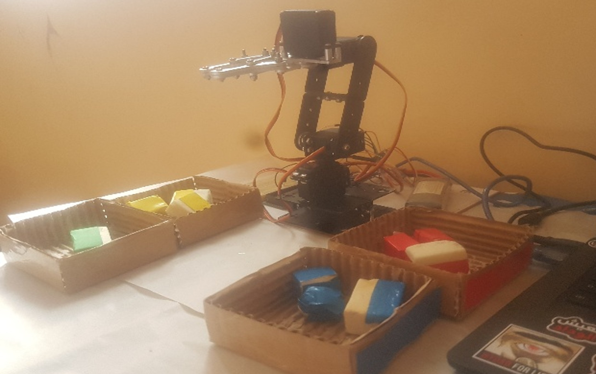

# 🤖 Vision-Based Robotic Arm for Object Sorting

<div align="center">


### 🎯 A 3-DOF Robotic Manipulator with Real-Time Computer Vision for Automated Color-Based Object Sorting

[Features](#-key-features) • [Demo](#-demo) • [Installation](#-installation) • [Usage](#-usage) • [Documentation](#-documentation)

---

</div>

## 📋 Table of Contents

- [Overview](#-overview)
- [Key Features](#-key-features)
- [Demo](#-demo)
- [System Architecture](#-system-architecture)
- [Hardware Components](#-hardware-components)
- [Software Stack](#-software-stack)
- [Installation](#-installation)
- [Usage Guide](#-usage-guide)
- [Operating Modes](#-operating-modes)
- [Results](#-results)
- [Industrial Applications](#-industrial-applications)
- [Future Enhancements](#-future-enhancements)
- [Contributing](#-contributing)
- [License](#-license)
- [Acknowledgments](#-acknowledgments)

---

## 🌟 Overview

This project presents the design and implementation of an intelligent **3-DOF robotic manipulator** equipped with **computer vision capabilities** for autonomous object sorting. The system combines physical control via Arduino Mega with an intuitive Python-based GUI (Tkinter), enabling multiple operation modes including manual control, pick-and-place, and automated color-based sorting.


## ✨ Key Features

<table>
<tr>
<td width="50%">

### 🎨 **Computer Vision**
- Real-time color detection (Red, Green, Blue, Yellow)
- HSV color space processing
- Object tracking and localization
- Robust contour detection

</td>
<td width="50%">

### 🦾 **Robotic Control**
- 3 Degrees of Freedom (3-DOF)
- Precise servo motor control
- Inverse kinematics implementation
- Smooth trajectory planning

</td>
</tr>
<tr>
<td width="50%">

### 🖥️ **User Interface**
- Intuitive Tkinter-based GUI
- Live camera feed display
- Multiple operating modes
- Real-time status monitoring

</td>
<td width="50%">

### 🔧 **Modularity**
- Open-source hardware & software
- Easy component replacement
- Scalable architecture
- Educational-friendly design

</td>
</tr>
</table>

---

## 🎬 Demo

### 📸 System Images

<div align="center">

#### Complete System Overview

<table>
<tr>
<td width="50%">

<p><em>Complete robotic arm setup with Arduino Mega and camera</em></p>
</td>
<td width="50%">

<p><em>Python Tkinter GUI with live camera feed</em></p>
</td>
</tr>
<tr>
<td width="50%">

<p><em>Color sorting Mode</em></p>
</td>
<td width="50%">

<p><em>Pick and Place Mode</em></p>
</td>
</tr>
<tr>
<td width="50%">

<p><em>Manual_Mode</em></p>
</td>
</tr>
</table>

</div>

### 🎥 Video Demonstration

<div align="center">

#### Watch the Robot in Action! 🚀

[](https://www.youtube.com/watch?v=Bcgm5BQceog)

---

## 🏗️ System Architecture


### 📊 Data Flow

1. **Image Acquisition** → Camera captures real-time video feed
2. **Vision Processing** → OpenCV detects and localizes colored objects
3. **Decision Making** → Python calculates target positions and angles
4. **Command Transmission** → Serial communication sends commands to Arduino
5. **Motion Execution** → Servos move arm to calculated positions
6. **Task Completion** → Object picked, sorted, or placed

---

## 🔩 Hardware Components

<div align="center">

| Component | Specification | Quantity | Purpose |
|-----------|---------------|----------|---------|
| **Arduino Mega** | ATmega2560 | 1 | Main controller |
| **Servo Motors** | MG996R (180°) | 4 | Joint actuation |
| **USB Camera** | 720p min | 1 | Vision system |
| **Power Supply** | 5V/3A | 1 | Servo power |
| **Breadboard** | 830 points | 1 | Prototyping |
| **Jumper Wires** | Dupont M-M/M-F | 40+ | Connections |
| **Mechanical Structure** | Custom 3D printed | 1 set | Frame & links |

</div>

### 🤖 Robot Specifications

- **Degrees of Freedom:** 3-DOF (Base rotation + 2 revolute joints)
- **Workspace:** Semi-circular, radius ≈ 25 cm
- **Payload Capacity:** 200g max
- **Positioning Accuracy:** ±5mm
- **Operating Speed:** 2-3 seconds per pick-place cycle

---

## 💻 Software Stack

<div align="center">

### Core Technologies


</div>

### 📚 Libraries & Frameworks

**Python Environment:**
```python
opencv-python >= 4.5.0    # Computer vision
numpy >= 1.19.0           # Numerical computing
pyserial >= 3.5           # Serial communication
tkinter                   # GUI framework (built-in)
Pillow >= 8.0.0          # Image processing
```

**Arduino Libraries:**
```cpp
#include <Servo.h>        // Servo motor control
```

### 🎨 Image Processing Pipeline

```python
# Simplified processing flow
1. Capture Frame → cv2.VideoCapture()
2. Color Space Conversion → cv2.cvtColor(BGR → HSV)
3. Color Masking → cv2.inRange(hsv, lower_bound, upper_bound)
4. Morphological Operations → cv2.dilate(), cv2.erode()
5. Contour Detection → cv2.findContours()
6. Moment Calculation → cv2.moments()
7. Centroid Extraction → (M10/M00, M01/M00)
```

---

## 🚀 Installation

### Prerequisites

- **Python 3.8+** installed
- **Arduino IDE 1.8+** installed
- **USB Camera or ip camera** connected
- **Arduino Mega** board with USB cable

### Step 1: Clone Repository

```bash
git clone https://github.com/Mohammed-El-Kassoiri/vision-robotic-arm.git
cd vision-robotic-arm
```

### Step 2: Install Python Dependencies

```bash
# Create virtual environment (recommended)
python -m venv venv

# Activate virtual environment
# On Windows:
venv\Scripts\activate
# On macOS/Linux:
source venv/bin/activate

# Install requirements
pip install -r requirements.txt
```

### Step 3: Arduino Setup

1. Open `arduino/code.ino` in Arduino IDE
2. Select **Board**: Tools → Board → Arduino Mega 2560
3. Select **Port**: Tools → Port → (your COM port)
4. Click **Upload** ✅

### Step 4: Hardware Assembly

---

## 🎮 Usage Guide

### Quick Start

```bash
# Navigate to project directory
cd vision-robotic-arm

# Run the main application
ce GUI
python code/run.py
```

### 🖱️ GUI Controls

<div align="center">

| Section | Function |
|---------|----------|
| **Connection Panel** | Connect/Disconnect to Arduino via serial port |
| **Mode Selection** | Choose operating mode (Manual/Pick-Place/Color Sort) |
| **Camera Feed** | Live video stream with detection overlay |
| **Manual Controls** | Individual servo angle sliders (0-180°) |
| **Status Display** | Real-time system status and coordinates |

</div>

---

## 🎯 Operating Modes

### 1️⃣ Manual Mode

**Direct servo control for testing and calibration**

```python
# Features:
- Individual servo angle adjustment (Base, Shoulder, Elbow, Gripper)
- Real-time angle display
- Gripper open/close buttons
- Reset to home position
```

**Use Cases:**
- System calibration
- Teaching positions
- Maintenance and debugging

---

### 2️⃣ Pick and Place Mode

**Semi-automated object manipulation**


**Commands:**
- `PICK` → Detect and grasp object at current position
- `PLACE` → Move to drop zone and release
- `AUTO PICK UP` → Full automated cycle

---

### 3️⃣ Color Sorting Mode

**Fully autonomous color-based classification**

```python
# Sorting Logic:
For each detected object:
    1. Identify color (Red/Green/Blue/Yellow)
    2. Calculate centroid coordinates (x, y)
    3. Compute inverse kinematics → angles [θ1, θ2, θ3]
    4. Move arm to object position
    5. Close gripper
    6. Navigate to corresponding color zone
    7. Open gripper to release
    8. Return to home position
    9. Repeat for next object
```

**Supported Colors:**
- 🔴 **Red** → Zone 1
- 🟢 **Green** → Zone 2
- 🔵 **Blue** → Zone 3
- 🟡 **Yellow** → Zone 4

---

## 📐 Kinematics Model

### Forward Kinematics

Position of end-effector given joint angles:

```
x = L₁·cos(θ₁)·cos(θ₂) + L₂·cos(θ₁)·cos(θ₂ + θ₃)
y = L₁·cos(θ₁)·sin(θ₂) + L₂·cos(θ₁)·sin(θ₂ + θ₃)
z = L₀ + L₁·sin(θ₂) + L₂·sin(θ₂ + θ₃)
```

### Inverse Kinematics

Joint angles given target position (x, y):

```python
# Base rotation
θ₁ = atan2(y, x)

# Distance to target
d = sqrt(x² + y²)

# Hypotenuse with base offset
h = sqrt(d² + L₀²)

# Auxiliary angles
α = acos(L₀ / h)
β = acos((h² + L₁² - L₂²) / (2·h·L₁))

# Shoulder angle
θ₂ = α + β

# Elbow angle
θ₃ = acos((L₂² + L₁² - h²) / (2·L₂·L₁))
```

**Link Lengths:**
- L₀ = 9.8 cm (Base height)
- L₁ = 10.4 cm (Upper arm)
- L₂ = 15 cm (Forearm)

---

## 📊 Results

### ✅ Functional Tests

<table>
<tr>
<th>Test Scenario</th>
<th>Success Rate</th>
<th>Notes</th>
</tr>
<tr>
<td>Manual Control</td>
<td align="center">✅ 100%</td>
<td>All servos responsive, smooth motion</td>
</tr>
<tr>
<td>Color Detection</td>
<td align="center">✅ 95%</td>
<td>Sensitive to lighting conditions</td>
</tr>
<tr>
<td>Pick & Place</td>
<td align="center">✅ 90%</td>
<td>Occasional gripper slip with small objects</td>
</tr>
<tr>
<td>Automated Sorting</td>
<td align="center">✅ 97%</td>
<td>High accuracy in controlled environment</td>
</tr>
</table>
---

## 🏭 Industrial Applications

<div align="center">

### 🌍 Real-World Use Cases

</div>

| Industry | Application | Benefits |
|----------|-------------|----------|
| 🍎 **Agriculture** | Fruit sorting by ripeness | Quality control, reduced waste |
| 📦 **Logistics** | Package classification | Faster processing, accuracy |
| ♻️ **Recycling** | Material separation | Environmental impact, efficiency |
| 🏥 **Pharmaceuticals** | Pill sorting and packaging | Safety, compliance |
| 🔧 **Manufacturing** | Component assembly | Precision, repeatability |

---

## 🔮 Future Enhancements

### 🎯 Planned Features

- [ ] **AI Integration**: Deep learning for object recognition beyond color
- [ ] **6-DOF Upgrade**: Add 3 more joints for full spatial manipulation
- [ ] **Multi-Object Handling**: Simultaneous tracking and queuing
- [ ] **Cloud Dashboard**: Web-based monitoring and analytics
- [ ] **Voice Commands**: Integration with speech recognition
- [ ] **Mobile App**: Remote control via smartphone
- [ ] **Safety Features**: Emergency stop, collision detection
- [ ] **ROS Integration**: Robot Operating System compatibility

### 🧪 Research Directions

- Reinforcement learning for motion optimization
- Stereo vision for 3D object localization
- Collaborative multi-robot systems
- Adaptive gripping based on object properties

---

## 🤝 Contributing

We welcome contributions! Here's how you can help:

### 🐛 Bug Reports

Found a bug? [Open an issue](https://github.com/Mohammed-El-Kassoiri/vision-robotic-arm/issues) with:
- Detailed description
- Steps to reproduce
- Expected vs actual behavior
- Screenshots/videos if applicable
---

## 📄 License

This project is licensed under the **MIT License** - see the [LICENSE](LICENSE) file for details.

```
MIT License

Copyright (c) 2025 Mohammed EL KASSOIRI

Permission is hereby granted, free of charge, to any person obtaining a copy
of this software and associated documentation files...
```


### 📚 Resources & Inspiration

- **Arduino Community** - Hardware support
- **OpenCV Documentation** - Computer vision guidance
- **Robotics Stack Exchange** - Technical discussions
- **GitHub Open Source Projects** - Code references

## 📞 Contact & Support

<div align="center">

### 👤 Mohammed EL KASSOIRI

[](https://linkedin.com/in/Mohammed-El-Kassoiri)
[](mailto:mohammed.kassoiri@gmail.com)
[](https://github.com/Mohammed-El-Kassoiri)

### ⭐ Show Your Support

Give a ⭐ if this project helped you!

</div>


---

<div align="center">

### 🌟 Project Statistics


---

**Made with ❤️ and ☕ by Mohammed EL KASSOIRI**

*Empowering Education Through Open-Source Robotics*

---

© 2025 Vision-Based Robotic Arm Project. All Rights Reserved.

</div>
